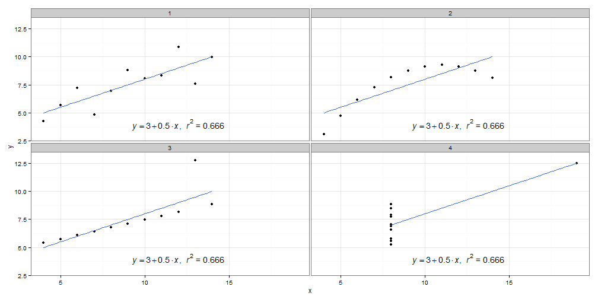
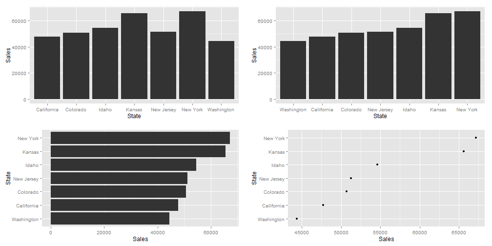
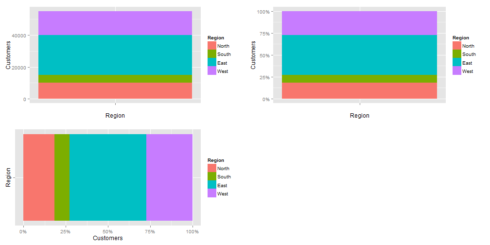
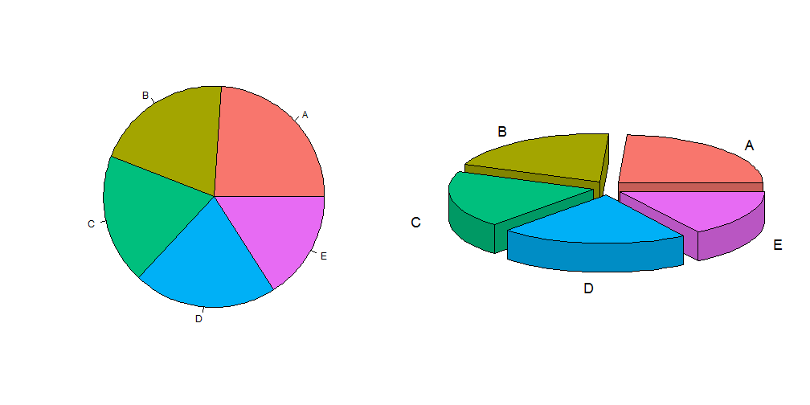
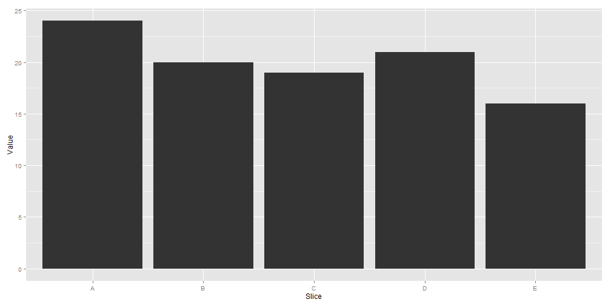
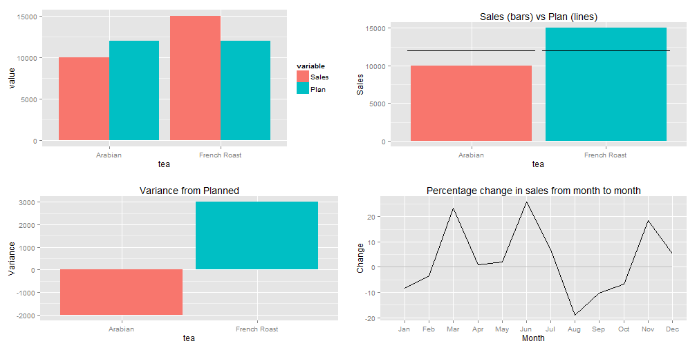
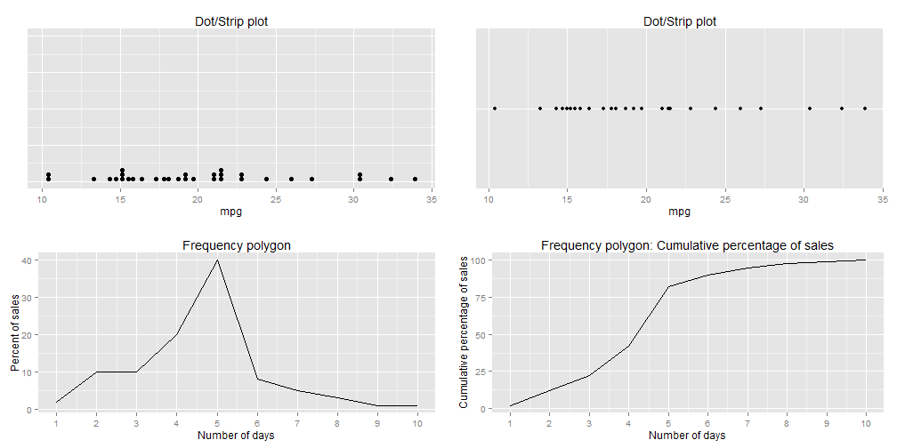
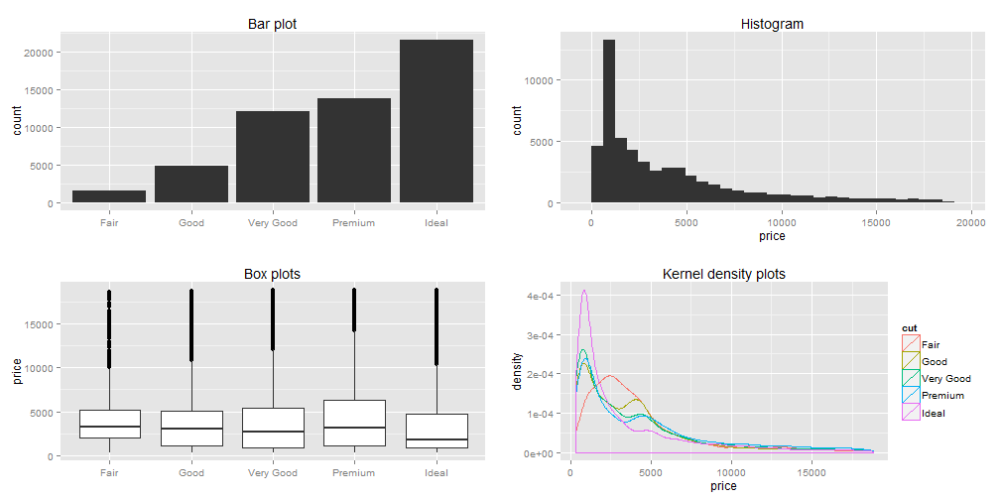
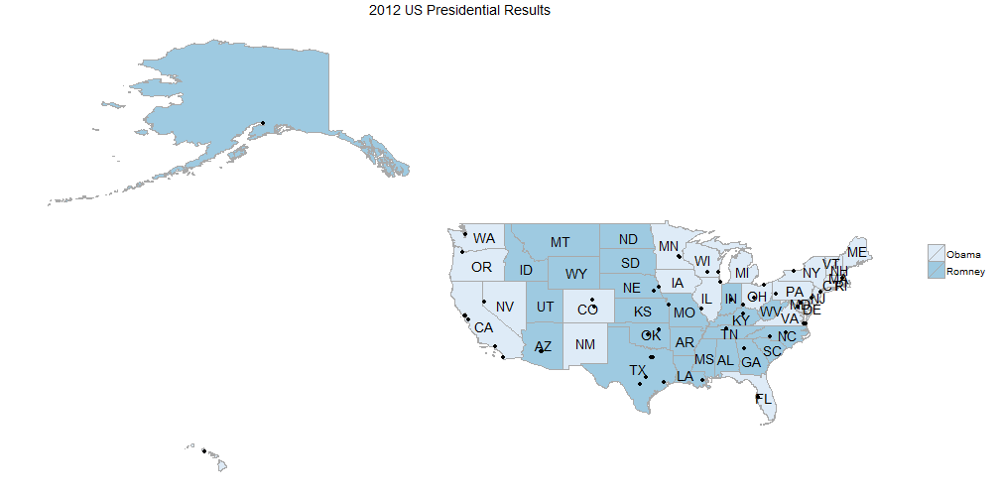

## Anscombe's Quartet

<table cellpadding="7">
 <thead>
  <tr>
   <th style="text-align:left;">   </th>
   <th style="text-align:right;"> x1 </th>
   <th style="text-align:right;"> y1 </th>
   <th style="text-align:right;"> x2 </th>
   <th style="text-align:right;"> y2 </th>
   <th style="text-align:right;"> x3 </th>
   <th style="text-align:right;"> y3 </th>
   <th style="text-align:right;"> x4 </th>
   <th style="text-align:right;"> y4 </th>
  </tr>
 </thead>
<tbody>
  <tr>
   <td style="text-align:left;"> 1 </td>
   <td style="text-align:right;"> 10 </td>
   <td style="text-align:right;"> 8.04 </td>
   <td style="text-align:right;"> 10 </td>
   <td style="text-align:right;"> 9.14 </td>
   <td style="text-align:right;"> 10 </td>
   <td style="text-align:right;"> 7.46 </td>
   <td style="text-align:right;"> 8 </td>
   <td style="text-align:right;"> 6.58 </td>
  </tr>
  <tr>
   <td style="text-align:left;"> 2 </td>
   <td style="text-align:right;"> 8 </td>
   <td style="text-align:right;"> 6.95 </td>
   <td style="text-align:right;"> 8 </td>
   <td style="text-align:right;"> 8.14 </td>
   <td style="text-align:right;"> 8 </td>
   <td style="text-align:right;"> 6.77 </td>
   <td style="text-align:right;"> 8 </td>
   <td style="text-align:right;"> 5.76 </td>
  </tr>
  <tr>
   <td style="text-align:left;"> 3 </td>
   <td style="text-align:right;"> 13 </td>
   <td style="text-align:right;"> 7.58 </td>
   <td style="text-align:right;"> 13 </td>
   <td style="text-align:right;"> 8.74 </td>
   <td style="text-align:right;"> 13 </td>
   <td style="text-align:right;"> 12.74 </td>
   <td style="text-align:right;"> 8 </td>
   <td style="text-align:right;"> 7.71 </td>
  </tr>
  <tr>
   <td style="text-align:left;"> 4 </td>
   <td style="text-align:right;"> 9 </td>
   <td style="text-align:right;"> 8.81 </td>
   <td style="text-align:right;"> 9 </td>
   <td style="text-align:right;"> 8.77 </td>
   <td style="text-align:right;"> 9 </td>
   <td style="text-align:right;"> 7.11 </td>
   <td style="text-align:right;"> 8 </td>
   <td style="text-align:right;"> 8.84 </td>
  </tr>
  <tr>
   <td style="text-align:left;"> 5 </td>
   <td style="text-align:right;"> 11 </td>
   <td style="text-align:right;"> 8.33 </td>
   <td style="text-align:right;"> 11 </td>
   <td style="text-align:right;"> 9.26 </td>
   <td style="text-align:right;"> 11 </td>
   <td style="text-align:right;"> 7.81 </td>
   <td style="text-align:right;"> 8 </td>
   <td style="text-align:right;"> 8.47 </td>
  </tr>
  <tr>
   <td style="text-align:left;"> 6 </td>
   <td style="text-align:right;"> 14 </td>
   <td style="text-align:right;"> 9.96 </td>
   <td style="text-align:right;"> 14 </td>
   <td style="text-align:right;"> 8.10 </td>
   <td style="text-align:right;"> 14 </td>
   <td style="text-align:right;"> 8.84 </td>
   <td style="text-align:right;"> 8 </td>
   <td style="text-align:right;"> 7.04 </td>
  </tr>
  <tr>
   <td style="text-align:left;"> 7 </td>
   <td style="text-align:right;"> 6 </td>
   <td style="text-align:right;"> 7.24 </td>
   <td style="text-align:right;"> 6 </td>
   <td style="text-align:right;"> 6.13 </td>
   <td style="text-align:right;"> 6 </td>
   <td style="text-align:right;"> 6.08 </td>
   <td style="text-align:right;"> 8 </td>
   <td style="text-align:right;"> 5.25 </td>
  </tr>
  <tr>
   <td style="text-align:left;"> 8 </td>
   <td style="text-align:right;"> 4 </td>
   <td style="text-align:right;"> 4.26 </td>
   <td style="text-align:right;"> 4 </td>
   <td style="text-align:right;"> 3.10 </td>
   <td style="text-align:right;"> 4 </td>
   <td style="text-align:right;"> 5.39 </td>
   <td style="text-align:right;"> 19 </td>
   <td style="text-align:right;"> 12.50 </td>
  </tr>
  <tr>
   <td style="text-align:left;"> 9 </td>
   <td style="text-align:right;"> 12 </td>
   <td style="text-align:right;"> 10.84 </td>
   <td style="text-align:right;"> 12 </td>
   <td style="text-align:right;"> 9.13 </td>
   <td style="text-align:right;"> 12 </td>
   <td style="text-align:right;"> 8.15 </td>
   <td style="text-align:right;"> 8 </td>
   <td style="text-align:right;"> 5.56 </td>
  </tr>
  <tr>
   <td style="text-align:left;"> 10 </td>
   <td style="text-align:right;"> 7 </td>
   <td style="text-align:right;"> 4.82 </td>
   <td style="text-align:right;"> 7 </td>
   <td style="text-align:right;"> 7.26 </td>
   <td style="text-align:right;"> 7 </td>
   <td style="text-align:right;"> 6.42 </td>
   <td style="text-align:right;"> 8 </td>
   <td style="text-align:right;"> 7.91 </td>
  </tr>
  <tr>
   <td style="text-align:left;"> 11 </td>
   <td style="text-align:right;"> 5 </td>
   <td style="text-align:right;"> 5.68 </td>
   <td style="text-align:right;"> 5 </td>
   <td style="text-align:right;"> 4.74 </td>
   <td style="text-align:right;"> 5 </td>
   <td style="text-align:right;"> 5.73 </td>
   <td style="text-align:right;"> 8 </td>
   <td style="text-align:right;"> 6.89 </td>
  </tr>
</tbody>
</table>

---
# Beauty of Quartet

<table cellpadding="3">
 <thead>
  <tr>
   <th style="text-align:right;"> datasource </th>
   <th style="text-align:right;"> x-mean </th>
   <th style="text-align:right;"> y-mean </th>
   <th style="text-align:right;"> x-variance </th>
   <th style="text-align:right;"> y-variance </th>
   <th style="text-align:right;"> correlation-xy </th>
  </tr>
 </thead>
<tbody>
  <tr>
   <td style="text-align:right;"> 1 </td>
   <td style="text-align:right;"> 9 </td>
   <td style="text-align:right;"> 7.500909 </td>
   <td style="text-align:right;"> 11 </td>
   <td style="text-align:right;"> 4.127269 </td>
   <td style="text-align:right;"> 0.8164205 </td>
  </tr>
  <tr>
   <td style="text-align:right;"> 2 </td>
   <td style="text-align:right;"> 9 </td>
   <td style="text-align:right;"> 7.500909 </td>
   <td style="text-align:right;"> 11 </td>
   <td style="text-align:right;"> 4.127629 </td>
   <td style="text-align:right;"> 0.8162365 </td>
  </tr>
  <tr>
   <td style="text-align:right;"> 3 </td>
   <td style="text-align:right;"> 9 </td>
   <td style="text-align:right;"> 7.500000 </td>
   <td style="text-align:right;"> 11 </td>
   <td style="text-align:right;"> 4.122620 </td>
   <td style="text-align:right;"> 0.8162867 </td>
  </tr>
  <tr>
   <td style="text-align:right;"> 4 </td>
   <td style="text-align:right;"> 9 </td>
   <td style="text-align:right;"> 7.500909 </td>
   <td style="text-align:right;"> 11 </td>
   <td style="text-align:right;"> 4.123249 </td>
   <td style="text-align:right;"> 0.8165214 </td>
  </tr>
</tbody>
</table>

---

Plots of the datasets

 

---
## Encoding Categorical Variables
 
 * 2D position
 * Hue
 * Point Shape
 * Fill pattern
 * Line Style

---

## Relationships usually displayed in graphs

* Time Series: Changes in variable(s) over time (Change, rise, increase, fluctuate, grow, decline, decrease, trend)
* Ranking (larger/smaller/equal to/greater/lesser)
* Part-to-whole (rate/percent/share of total/accounts for n percent)
* Deviation (absolute/percentage/rate of deviations from a reference value,)
* Distribution (frequency, distribution, range, concentration, normal)
* Correlation (how variables covary - increases/decreases/changes with, caused by, affected by)
* Geospatial (spatial, geographical - county/city/region/state/...)
* Nominal comparison (simple comparison of categorical variables - alphabetical/ascending/descending)

---

## Nominal Comparisons
 

---
## Time Series
 

---
## Ranking

 

---
## Part-to-Whole

 

---
## Shapes with 2-D areas (area-graphs)
 

---
## Shapes with 2-D or Bars?
 

---

## Part-to-Whole
Pie-charts, for their disadvantages, are easily recognized. Can use bars close to each other.
 

---
## Deviation Designs
 

---
## Studying Distributions

 

---
## More distributions

 

---
## Correlations

 

---
## Geo-Spatial Designs

 

---
## Geo-Spatial Designs

 

---
## Geo-Spatial Designs

 

---
## Geo-Spatial Designs

---
## Acknowledgements

* Most of the content derived from chapter titled "Fundamental Variations of Graphs" in Stephen Few's book: "Show Me the Numbers" 
* Almost all graphs created using the `ggplot2` package in R
* The presentation was created using the `slidify` package in R  
* Code for this presentation can be found at: https://github.com/patilv/TypesofGraphsABCD
* The presentation can be found at: http://patilv.com/TypesofGraphsABCD

---
